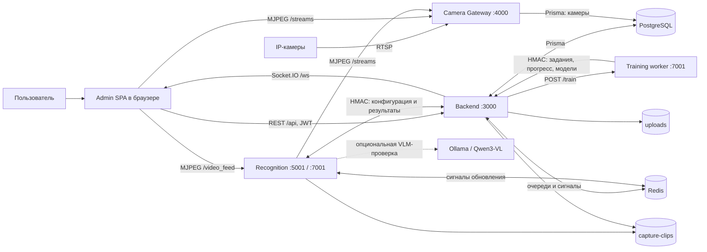
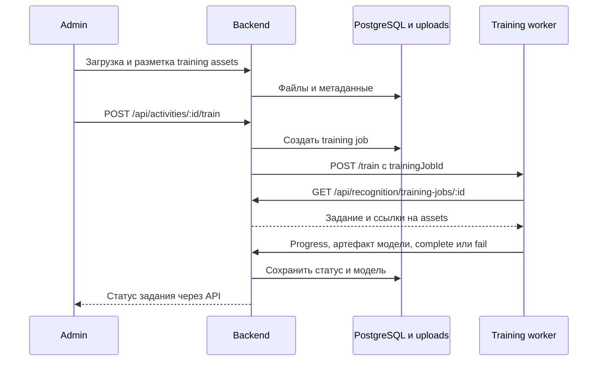

# Как работает Aikeen: взаимодействие сервисов

Сверено с локальными репозиториями 2026-09-23. Схемы показывают логические связи. В production браузер обычно обращается к сервисам через Nginx (`/`, `/api`, `/ws`, `/streams`, `/video_feed`); при локальном запуске используются опубликованные Compose-порты.

## Общая схема

`Admin` — SPA, исполняемая в браузере. Она не подключается к PostgreSQL или Redis. Backend хранит конфигурацию и результаты; Gateway преобразует RTSP в MJPEG; Recognition анализирует кадры; training worker обучает модели отдельно от потока распознавания.

## Просмотр камеры и распознавание

1. Admin получает список камер через backend. Для обычного просмотра он запрашивает `GET /api/cameras/:id/stream-url`; backend возвращает URL Gateway `/streams/:id.mjpg?token=...`.
2. Gateway читает настройки камеры в PostgreSQL, подключается к ней по RTSP и раздаёт MJPEG. Один FFmpeg-процесс может обслуживать нескольких клиентов одной камеры.
3. Recognition запрашивает у backend камеры и конфигурацию через `GET /api/recognition/cameras`, получает внутренний URL того же MJPEG потока и обрабатывает кадры. Для всех камер используется один streaming API: `/video_feed?cameraId=:id` на порту `5001`.
4. Recognition связывает лицо с person track, запускает action model на person crops и при настроенном verifier проверяет сильные кандидаты через Qwen3-VL. Результаты и интервалы он отправляет в backend через служебный API.
5. Backend сохраняет данные и рассылает обновления через Socket.IO. Admin показывает присутствие, статистику и evidence; для распознанного видеопотока он открывает `/video_feed?cameraId=:id`.

## Обучение модели

Для classifier groups используется аналогичный процесс с отдельными маршрутами заданий. Worker обучает VideoMAE на person crops. Артефакты моделей и training assets хранятся в постоянном `backend/uploads`.

## Доступ и хранение

| Связь | Механизм |
| --- | --- |
| Браузер → Backend | JWT для пользовательских API |
| Recognition/worker → Backend | HMAC-подпись служебных запросов |
| Браузер/Recognition → Gateway | Токен Gateway в URL потока или заголовке |
| Backend/Gateway → PostgreSQL | Prisma |
| Backend/Recognition → Redis | Очереди, кэш и сигналы обновления |

`uploads` содержит фотографии, обучающие файлы, модели и evidence-кадры. Общий том `capture-clips` содержит записанные Recognition клипы, которые backend индексирует и отдаёт для разметки. `backup-data.sh` сохраняет PostgreSQL и `uploads`, но не `capture-clips`.

Подробнее: [Backend](BACKEND_DOCUMENTATION.md), [Camera Gateway](CAMERA_GATEWAY.md), [Recognition](RECOGNITION_SERVICE.md), [Infra](INFRA.md).
